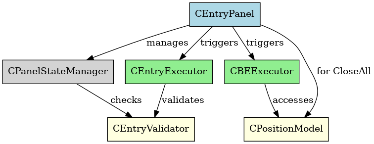

# EPT_executorMap.md

---

## 第1章. 概要

本ドキュメントは、EdgeProTraderプロジェクトにおける戦略Executorの構造マップを整理し、初期MQL4実装（v1.4〜v1.5）における依存関係と責務の視覚化、将来的なMQL5移植・戦略拡張に備えたI/F設計の明示を目的とする。

> 🔗 詳細なインターフェース定義については [EPT_interfaceMap.md](EPT_interfaceMap.md) を参照のこと。

---

## 第2章. 構造マップ（v1.4〜v1.5）

### 2.1 クラス依存図

> ※ 青：UI層（View）、緑：実行層（Trade）、灰／黄：ロジック（Logic）

### 2.2 構成要素一覧

| クラス名              | モジュール | 役割                                 | 備考                                |
|-----------------------|------------|--------------------------------------|-------------------------------------|
| `CEntryPanel`         | View       | UIパネル描画、ボタンイベント処理             | Entry/BE/CloseAll のトリガーを担当         |
| `CPanelStateManager`  | Logic      | ボタンの有効化判定、状態遷移制御           | 状態管理の中核。Validatorを参照            |
| `CEntryExecutor`      | Trade      | SHORT/LONGボタン押下時の成行注文実行         | `OrderSend`を使用                        |
| `CBEExecutor`         | Trade      | BEボタン押下時にSLを建値へ移動             | `OrderModify`による更新                     |
| `CEntryValidator`     | Logic      | スプレッド・時間帯などの取引可否判定        | 条件によりEntry拒否                        |
| `CPositionModel`      | Logic      | 保有ポジションの抽象取得・選択             | BEとCloseAll判定に使用                     |

---

## 第3章. I/Fマッピング（初期実装）

| 中間I/F                      | 実装クラス         | 機能概要                                       |
|-----------------------------|--------------------|------------------------------------------------|
| `IMarketOrderExecutor`      | `CEntryExecutor`   | SHORT/LONGの成行注文送信                              |
| `ISLModifier::ModifySL()`   | `CBEExecutor`      | SLを建値へ移動                                    |
| `IEntryConditionEvaluator`  | `CEntryValidator`  | スプレッド・時間帯条件に基づくエントリー可否判定           |
| `CloseAll`（独自実装）         | `CEntryPanel` or `CEntryExecutor` | 全ポジション順次クローズ（OrderClose）             |

> ※ `CPanelStateManager` はUI制御に特化し、中間I/Fとは独立に設計される。

---

## 第4章. 今後の拡張と分離構想

### 4.1 MQL5以降に予定される戦略機能

| 拡張カテゴリ          | 概要                                           | 対応予定I/F                           |
|-----------------------|------------------------------------------------|----------------------------------------|
| 複数TP／段階利確       | 第一TP／第二TP設定とトレーリングの組合せ                  | `ISLModifier`                          |
| 予約注文（Pending型）  | 指値・逆指値の自動発注＋時間キャンセル                   | `IPendingOrderPlacer`, `Canceller`     |
| 条件付きエグジット      | ローソク足やZigZagによる撤退判定                       | `IExitEvaluator`                        |
| 部分決済              | 指定ロットのみ決済処理                                | `IMarketOrderExecutor::ClosePartial()` |

### 4.2 クラス抽象と構造分離方針

- `COrderExecutorBase`：パラメータ統合ベース（symbol/lot/SL等）
- `I〇〇Executor`：戦略単位のインターフェースで機能分類
- Executorクラス：複数I/Fの多重継承により柔軟に構成
- View側：`interface_cast<>`で機能の有無を判定し動的呼び出し

今後はこのマップを土台に戦略テンプレート（PLANモード）との連携も進める。

---

