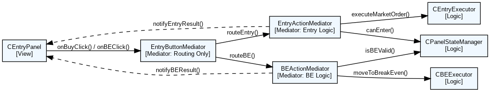

## ✅ Mediator_Controller_Map.md

| Mediator名             | 呼び出すController群               | 役割（ルーティング対象）                                  |
|------------------------|--------------------------------------|------------------------------------------------------------|
| EntryMediator          | EntryController, BEController       | ボタンイベントの受付と処理ルートの分岐                  |
| TPLineMediator（予定） | TPController                        | TPライン移動操作の受付と処理への振り分け（予定）         |
| HistoryMediator（予定）| HistoryController                   | ポジション履歴の描画など、表示系処理の分岐（予定）      |

## ✅ Controller_Responsibility.md

### EntryController
- 処理対象：Buy / Sell ボタンによる成行発注
- 主な責務：
  - `CanEnter()` による発注条件の確認
  - `ExecuteOrder()` による注文実行
  - `UpdateEntryUI()` による画面反映

### BEController
- 処理対象：BE（建値）ボタンによるブレイクイーブン移動
- 主な責務：
  - ポジション数・状態の確認（BE条件）
  - `MoveToBreakEven()` によるSL移動処理
  - `ShowBEResult()` によるユーザー通知

### TPController（予定）
- 処理対象：TPライン移動時の処理
- 主な責務：
  - ライン操作の受け入れ・確認
  - `UpdateTP()` による内部TP設定の更新
  - `UpdateTPUI()` によるライン再描画

### HistoryController（予定）
- 処理対象：過去のトレード履歴の描画
- 主な責務：
  - 過去ポジションの取得と評価
  - ラベルやラインの描画

## ✅ Refactor_StepPlan.md

### フェーズ1：EntryController構築と適用
- `CEntryStateController` の `RequestEntry()` を `EntryController` に移管
- `EntryMediator` 経由で `onBuyClick()` → `EntryController.Execute()` にルーティング
- UC01〜UC03で挙動確認

### フェーズ2：BEController構築と適用
- `RequestBE()` 相当の処理を `BEController` に切り出し
- 状態確認ロジックも責務移管
- UC04, UC05（BE系）で動作確認

### フェーズ3：Mediatorルート統合と既存クラス整理
- `CEntryStateController` → `EntryMediator` を正式ルートに
- Viewから `EntryMediator` を呼ぶ構成に書き換え
- 旧メソッドは削除 or Wrapper化

### フェーズ4（任意）：拡張準備
- `TPController`, `HistoryController` 構想ベースの構造を仮クラスで用意
- 将来の設計パターン再利用を意識した整理を進行

## ✅ 関数移管マッピング案（暫定）

### CEntryStateController → EntryController
- `OnEntryButtonClicked()` → `EntryController.ExecuteEntry()`
- `OnSLButtonClicked()` → `EntryController.OnSLInput()`
- `OnResetButtonClicked()` → `EntryController.Reset()`

### CEntryStateController → BEController
- `OnBEButtonClicked()` → `BEController.ExecuteBE()`
- `OnPositionClosed()` → `BEController.NotifyClose()`

### CEntryStateController → 共通Mediator / View直接
- `SetCurrentUC()` / `GetCurrentUC()` → EntryMediator or Controller保持
- `Initialize()` → Mediatorまたはルート呼び出し元で統合管理

### CPanelStateManager 参照ポイント
- `setDependencies()` → Mediator初期化内で実行
- `getStateCode()` / `GetCurrentState()` → Controllerで使用
- `SetState()` / `UpdateState()` / `OnSLLineShown()` / `OnEntryExecuted()` → EntryControllerで呼び出し
- `OnPositionClosed()` → BEControllerで使用

### CPositionModel 呼び出し元（Controllerが利用）
- `HasOpenPosition()` / `GetPositionTickets()` / `GetOpenTicket()` → 各Controllerが間接的に利用
- `CountOpenPositions()` → EntryController / BEController
- `IsBuy()` / `IsSell()` → 処理分岐に応じて使用

